### Website Link: [pages-nu-mauve.vercel.app](https://pages-nu-mauve.vercel.app)
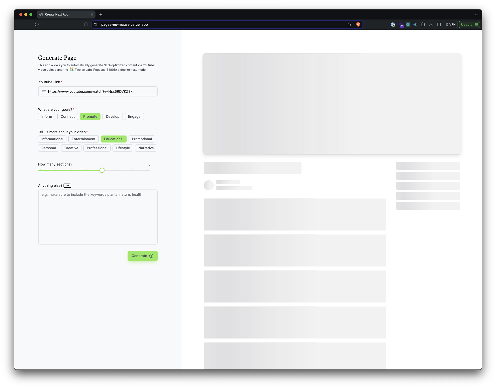

# What I will be building:
A platform that takes video as an input and produces bite-sized blogs for [SEO](https://en.wikipedia.org/wiki/Search_engine_optimization) optimization.

The app currently:
- Accepts a mock YouTube video input (A YC Video), and allows users to tune generation
- Generates a banner, title, text content, and table of contents via `/twelvelabs` and `/groq` apis
- Allows users to edit portions of text via custom prompting

## Getting Started

This is a [Next.js](https://nextjs.org/) project bootstrapped with [`create-next-app`](https://github.com/vercel/next.js/tree/canary/packages/create-next-app).

First, run the development server:

```bash
npm run dev
# or
yarn dev
# or
pnpm dev
# or
bun dev
```

Open [http://localhost:3000](http://localhost:3000) with your browser to see the result.

You can start editing the page by modifying `app/page.tsx`. The page auto-updates as you edit the file.

This project uses [`next/font`](https://nextjs.org/docs/basic-features/font-optimization) to automatically optimize and load Inter, a custom Google Font.


# Motivation
The inspiration behind this idea comes from [perplexity pages](https://www.perplexity.ai/hub/blog/perplexity-pages). I firmly believe that Answer Engines are the new search engines. Answer engines are designed to to provide concise and accurate answers to user queries. As we rely more on this new technology, content should be structured to lead with value. That's where improving [Answer Engine Optimization (AEO)](https://blog.marketmuse.com/what-is-answer-engine-optimization/) comes in, requiring engineering efforts in structuring data, and user intent to increase its effectiveness (I remember Aaravind Srinivas talking about how difficult this was on Lex's podcast).

Everyone is working on AEO. Take a look at this AI startup [jotbot](https://myjotbot.com/blog). Although they have many blogs, they trade off quantity for quality. This is a temporary solution, but if you believe in Answer Engines, then the quality of good blog posts should be the most important factor and should reflect expertise. Similarly, Google already have ways in preventing the [gamifcation](https://blog.hubspot.com/marketing/diagnose-fix-google-penalty) of SEO, if you believe in Answer Engines and AI agents scraping are the future (which I do), then there must be some effort in creating quality and structured content.

I took some [inspiration](https://playground.twelvelabs.io/indexes/65eff5b16dc02a0c6004a059/generate?v=65f0045566995fbd9fd64d7d&cache=true&mode=template&st=chapter&cp=Divide+the+chapters+step+by+step+introduced+in+this+video) behind the examples on the twelvelabs website for the UI. They have some APIs for video summarization so I will be trying those out.

# Requirements

I'm going to keep this app dead simple. Here are the functional requirements:
- input some video (youtube link should work)
- output some blog
- allow users to make some quick edits
- UI/UX must be intuitive and 'beautiful'

Tech stack:
- nextjs + ts, tailwind, python, aws, nextui

# Engineering Process

I started by drawing a sketch of what I wanted this app to look like.


 
and then drafted the frontend for the app:

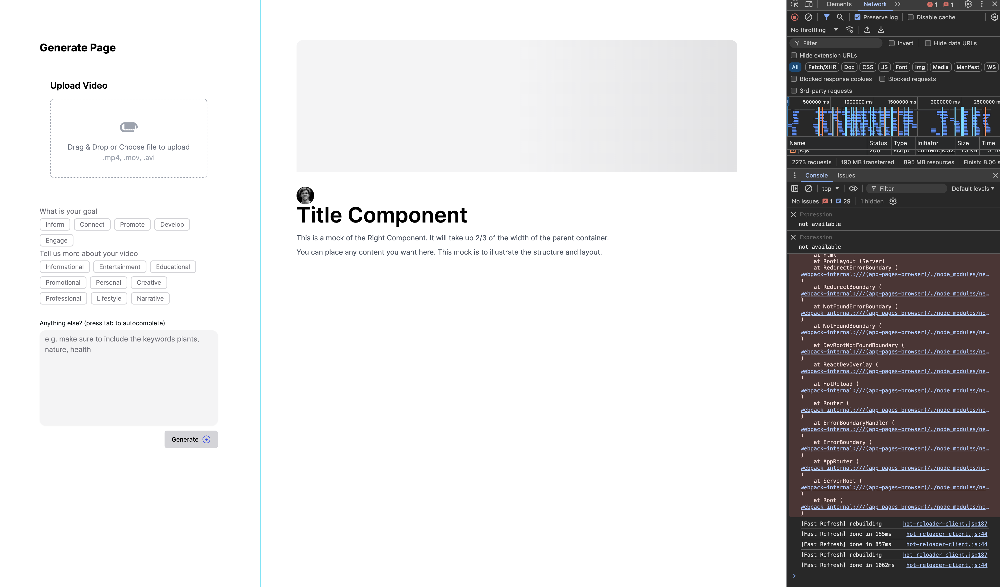

also added some loading components to support the control center on the left

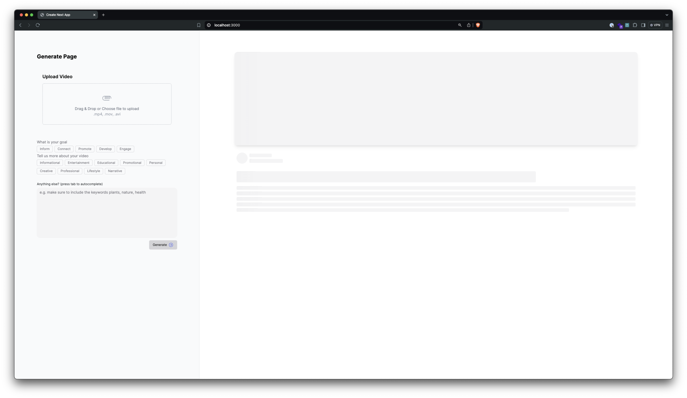

I also cleaned up the UI for the left component


It was also important to me that users who just wanted to play around with the app could quickly `tab` to autocomplete the text area or the youtube link. I went ahead and created a `TabPressed` and `TabUnpressed` svg in Figma

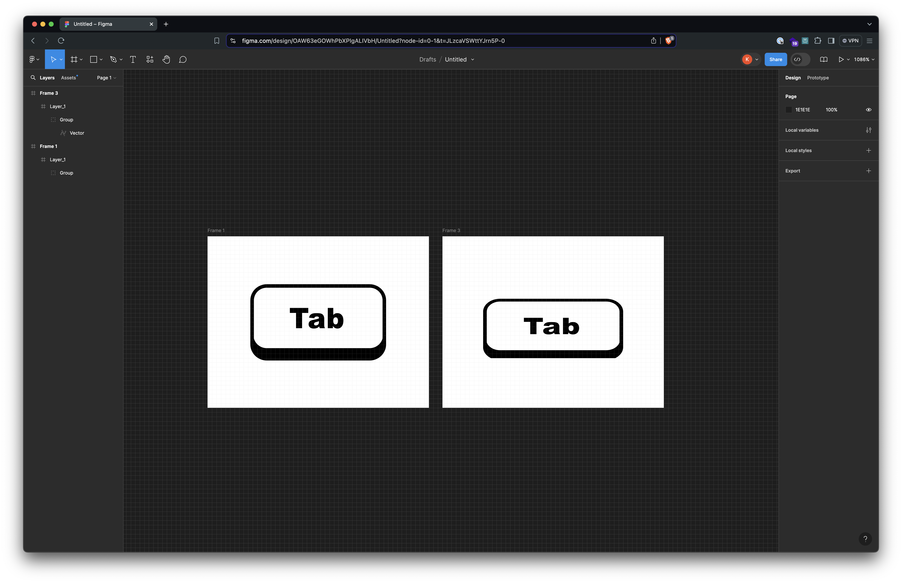

and put it above the text area component

```typescript
// left.tsx
// functions to handle state changes
const handleKeyDown = (e: React.KeyboardEvent<any>, field: string) => {
        if (e.key !== 'Tab') return
        e.preventDefault();

        if (field === "videoUrl") { setVideoUrl(yc_video) }
        if (field === "additionalInfo") { setIsTabPressed(true); setAdditionalInfo("e.g. make sure to include the keywords plants, nature, health"); }
    };

const handleKeyUp = (e: React.KeyboardEvent<any>) => { if (e.key !== 'Tab') return; setIsTabPressed(false); };

// return statement...
    <Textarea
        label={
            <div className="flex items-end space-x-1">
                <span>Anything else?</span>
                {isTabPressed ? (
                    <div className="align-bottom"><TabPressed /></div>
                ) : (
                    <div className="align-bottom"><TabUnpressed /></div>
                )}
            </div>
        }
        // ... more props
    </Textarea>
```

Go ahead and play with it I find it a small but nice touch to the UX.

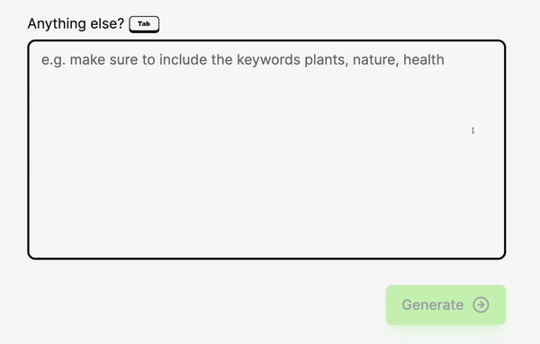


I wasn't satisfied with the UI of both the left and right components. Before reading my feedback, consider what you would improve as a programmer (I'm not a designer). Then, compare your ideas with mine.

My design philosophy is:
1. I’d rather make a good website than make a comprehensive one, and 
2. [minimal contrast](https://evanjconrad.com/posts/design-advice) was important.

Here were things that bothered me and so I changed:
- cumulative shift of the warning message for the youtube link
- cumulative shift of the generate button
- styles and colors of the subheadings have to match
- what happens when I shrink the window width? how should the components react (on top? side?)
- rounding of the corners need to be consistent, and thin out the borders for some of the components
- let’s add some shadows between components for a bit more contrast
- serif fonts for titles to build contrast

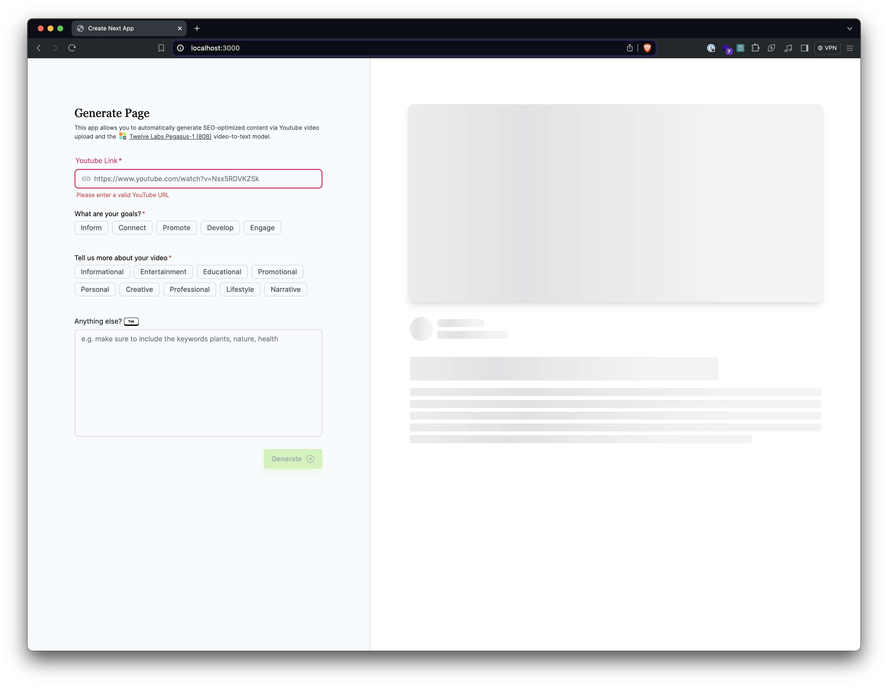

Now that I have my frontend done, I was ready to work on the backend API calls. My goals for the backend was to [KISS](https://en.wikipedia.org/wiki/KISS_principle) — I avoided touching cloud, middlewares, or mocking software. 

### Backend Flow (Draft #1)
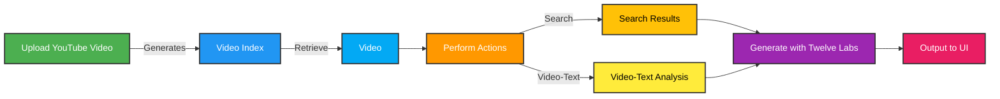
```mermaid
graph LR
    A[Upload YouTube Video] -->|Generates| B[Video Index]
    B -->|Retrieve| C[Video]
    C --> D[Perform Actions]
    D -->|Search| E[Search Results]
    D -->|Video-Text| F[Video-Text Analysis]
    E --> G[Generate with Twelve Labs]
    F --> G
    G --> H[Output to UI]
    
    style A fill:#4CAF50,stroke:#333,stroke-width:2px,color:white
    style B fill:#2196F3,stroke:#333,stroke-width:2px,color:white
    style C fill:#03A9F4,stroke:#333,stroke-width:2px,color:white
    style D fill:#FF9800,stroke:#333,stroke-width:2px,color:white
    style E fill:#FFC107,stroke:#333,stroke-width:2px,color:black
    style F fill:#FFEB3B,stroke:#333,stroke-width:2px,color:black
    style G fill:#9C27B0,stroke:#333,stroke-width:2px,color:white
    style H fill:#E91E63,stroke:#333,stroke-width:2px,color:white
```

Here is the `/gist` endpoint for the twelvelabs API I used for the title component.

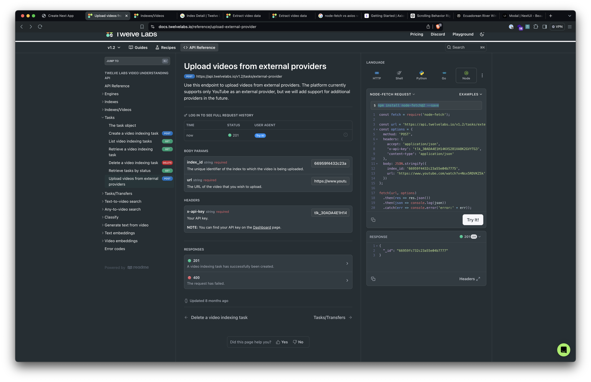

And as I started playing around with the YouTube file uploads, there was a bug with the endpoint where I ended up with 7 replicas of the same video for one index upload call.

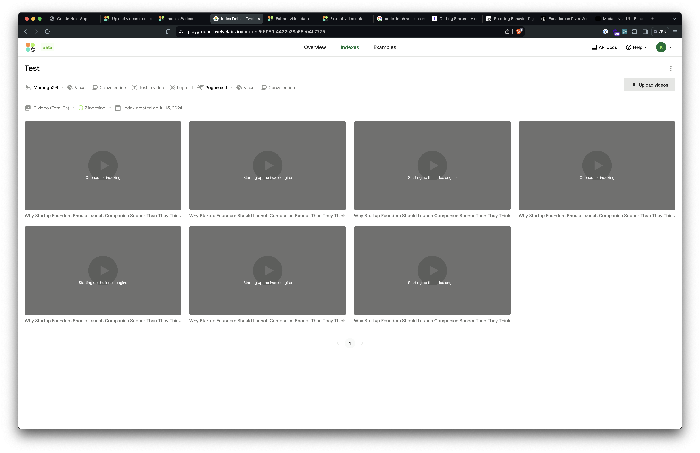


This was bad... very bad.
1. uploading videos to a twelvelabs index took a long time (despite already switching from upload video to upload YouTube video). Apps like the ones I was trying to make were not ideal for slow APIs.
2. there were bugs in the duplicates video uploads for an index [(via this endpoint)](https://docs.twelvelabs.io/reference/upload-external-provider). 
3. APIs were super slow, up to 1100+ms (10 seconds!) for each API call and response

Solutions:
1. Let's use groq for some additional llm generation with `llama-70b-8192`. It's a free and fast solution.
2. I don't want to deal with asynchronous generations and working on that UI/UX — it completely nullifies the one-click summarization promise I wanted my app to deliver. So for now I will just mock a single video for most of the backend generations, and then also force the user to only use my pre-indexed video for the generations. I'll still be calling the twelvelabs api, but if this were a real production app I wanted to deliver to users i'd either not use the twelvelabs api, or use the twelvelabs api but cache the summarizations (because endpoints like `/gist` and `/summarize` are already cached anyways).

And so here I graph what was intended vs what's actually feasible.

### Improved backend flow (Draft #2)
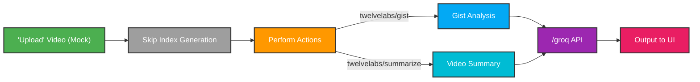
```mermaid
    graph LR
    A["'Upload' Video (Mock)"] --> B[Skip Index Generation]
    B --> C[Perform Actions]
    C -->|twelvelabs/gist| D[Gist Analysis]
    C -->|twelvelabs/summarize| E[Video Summary]
    D --> F[ /groq API]
    E --> F
    F --> G[Output to UI]
    
    style A fill:#4CAF50,stroke:#333,stroke-width:2px,color:white
    style B fill:#9E9E9E,stroke:#333,stroke-width:2px,color:white
    style C fill:#FF9800,stroke:#333,stroke-width:2px,color:white
    style D fill:#03A9F4,stroke:#333,stroke-width:2px,color:white
    style E fill:#00BCD4,stroke:#333,stroke-width:2px,color:white
    style F fill:#9C27B0,stroke:#333,stroke-width:2px,color:white
    style G fill:#E91E63,stroke:#333,stroke-width:2px,color:white
```

Now that I've made some design changes to the backend flow. Let's actually implement it. Here are some improvements that I've made to the general app and the UI.

Originally I wanted to use the `/twelvelabs/retreive-thumbnail` endpoint for the for the banner, but the image it returns produces a blurry thumbnail image which isn't great (probably due to storage restraints). I also wanted to probably do diffusion for the banner generation, but since that isn't cost-feasible at this time i'll opted to use `https://picsum.photos/{width}/{height}` which returns an image in any (w x h) dim you specify.

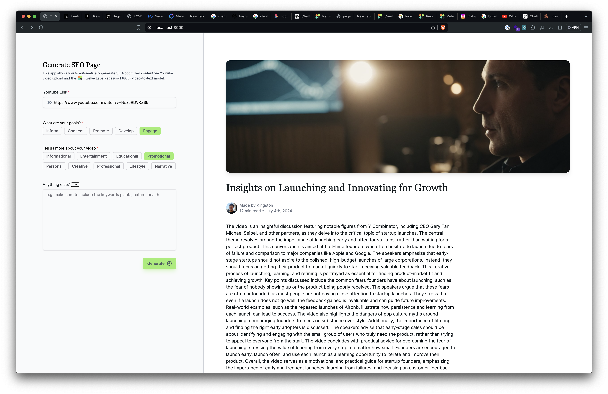

I also ran into more problems when dealing with the backend calls. I thought this would be a good opportunity to learn some more about [Next.JS API Routes](https://nextjs.org/docs/pages/building-your-application/routing/api-routes). So instead of storing keys on the frontend client side, we obscure that as a component in the frontend and call a specific backend route (in `http:localhost:{port}/page/api/{your_endpoint}`) that vercel hosts. You can see in the following image that there is a warning where the `apiKey` could be dangerously exposed in the frontend. This is because I initially made the API calls in the `left.tsx` page, in which I defined it to be a `"use client"` page

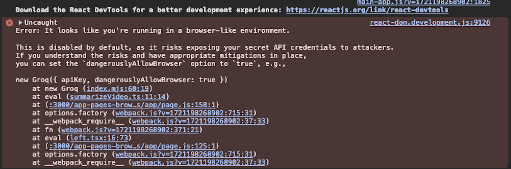

Let me show you how I fixed it. Here is the code that exists in `pages/api/twelvelabs.ts` and similarly for `pages/api/groq.ts`. Everything in the directory `pages/api/*` will be treated as an endpoint instead of a page, and don't increase client-side bundle size.

```typescript
// api/twelvelabs.ts and api/groq.ts
export default async function handler(req: NextApiRequest, res: NextApiResponse) {
  if (req.method !== 'POST') return res.status(405).json({ error: 'Method not allowed' });
  const { bodyParm1, bodyParm2 } = req.body;
  try {
    // Your api call here...
    return res.status(200).json(completion.choices[0].message.content);
  } catch (error) {
    console.error('error:', error);
    return res.status(500).json({ error: 'An error occurred while processing API request' });
  }
}
```

We can then create a component in `/api-calls.ts` that is responsible for making the `pages/api/*` calls, and put all our other api fetch functions in here.

```typescript
// api-calls.ts
export async function fetchTwelveLabsData(
    videoUrl: string,
    action: 'gist' | 'summary' | 'highlight' | 'chapter',
    temperature?: number,
    prompt?: string,
): Promise<TwelveLabsGistResponse | TwelveLabsSummaryResponse> {
    const response = await fetch('/api/twelvelabs', { // this is the /twelvelabs.ts
        method: 'POST',
        headers: {
            'Content-Type': 'application/json',
        },
        body: JSON.stringify({ videoUrl, action, temperature, prompt }),
    });
    if (!response.ok) throw new Error(`HTTP error! status: ${response.status}`);
    return await response.json(); // return to the component
}
```

Then we can safely call this code in the frontend components:

```typescript
// right.tsx
const handleRegenerate = async (index: number, prev_title: string, prev_content: string) => {
        setIsRegenerating(true);
        try {
            const response = await fetchGroqData(videoUrl, "regenerate", undefined, prev_title, prev_content, popoverPrompt, undefined);
            const responseJSON = JSON.parse(response);

            // reset the states in our frontend component
            setRegeneratedTitles(prev => ({
                ...prev,
                [index]: responseJSON.new_title
            }));
            setRegeneratedContents(prev => ({
                ...prev,
                [index]: responseJSON.new_content
            }));

        } catch (error) {
            console.error("Error regenerating content:", error);
        } finally {
            setIsRegenerating(false);
        }
    };
```

When deployed on Vercel, we see that the files in the `/api` directory are properly categorized as Functions. Also pro tip, restart your local deployment with `npm run dev` to sometimes troubleshoot the api endpoints not being called.

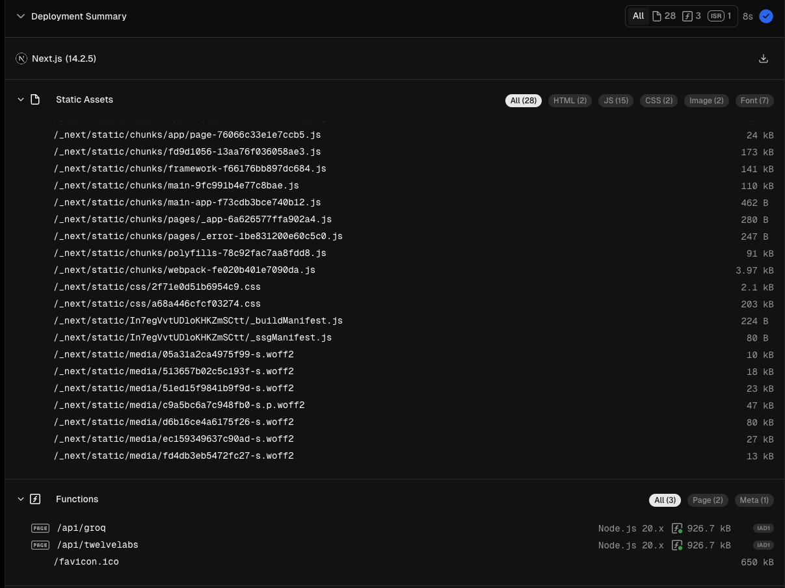

I also occasionally ran into `504 server timeout error` which is due to some proxy timeouts on the server side for api calls for some of the `twelvelabs/generate` endpoints. I couldn't figure out what went wrong (might not even be my problem), so for most of the text generation I just opted for groq for most of my text generations.

For text generation groq also uses a JSON_MODE `response_format: { type: "json_object" }` in the api parameter call. This is super helpful in only receiving validated data types and spares me the need to parse them from stringed text every time. However, you must also be careful in checking the return types of these API promises. I've encountered errors several times because I think that the groq api correctly returns a JSON object:

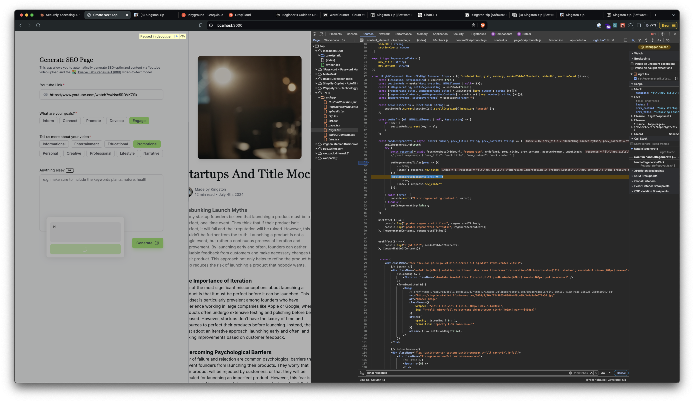

Instead, the response is wrapped in double quotes `"{}"`, so you must call the `const parsed_response = JSON.parse(response)` to convert it to a parseable JSON Object. I thought that explicitly declaring the type of the promise response would work, but sometimes it failed and I never really dug deep into that. So just remember to call the .parse() function.

I also opted to create a table of contents component where users can click on to jump directly to the content. I used [nextui's listbox component](https://nextui.org/docs/components/listbox)

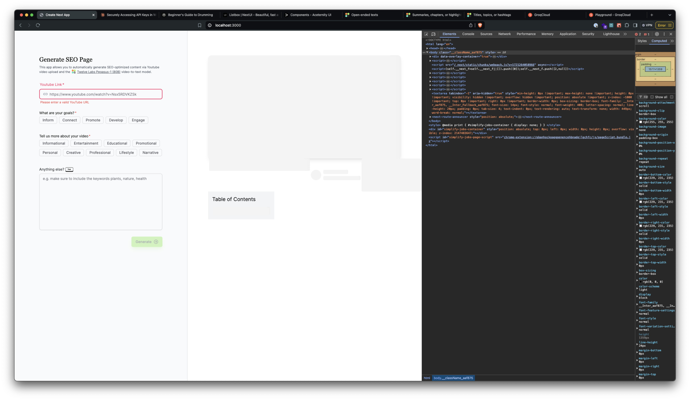

as well as a popover that allowed users to change the sections with whatever they wanted. This was also done with a `/groq` call. I used [nextui's popover component](https://nextui.org/docs/components/popover)

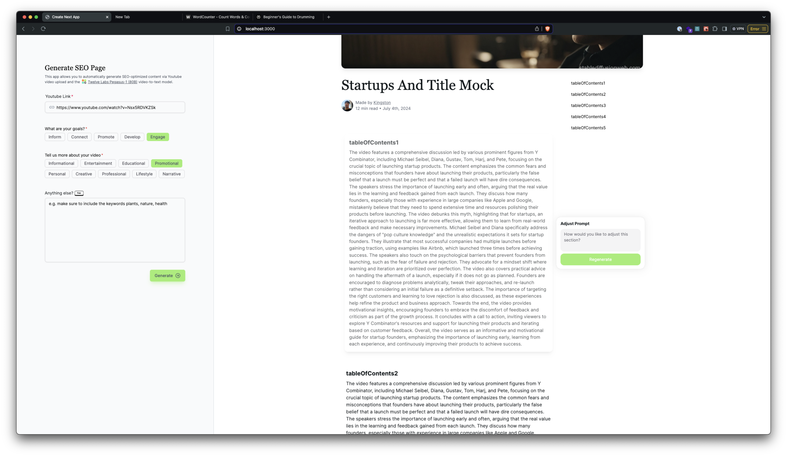

After testing with the real API endpoints, I deployed it onto Vercel but still ran into some errors. Let's pull up the debugger again.

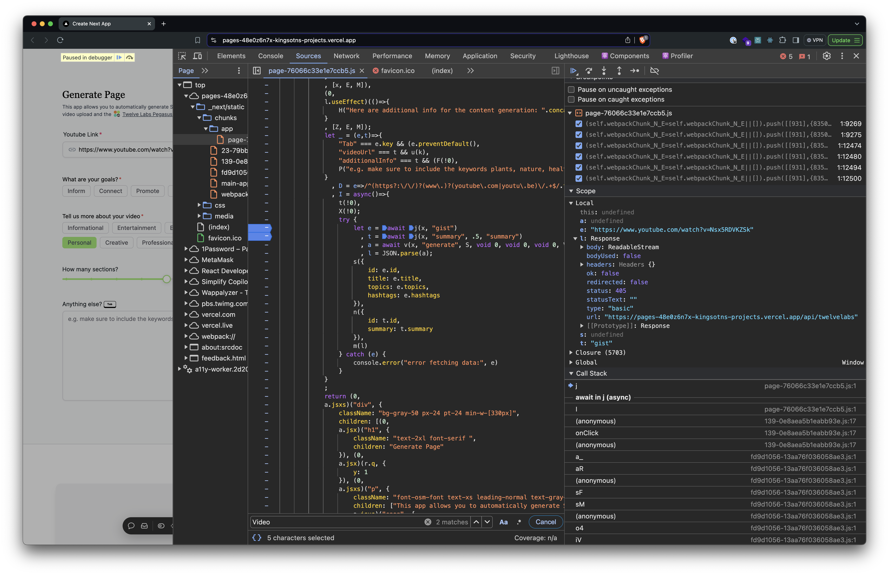

After some debugging, I thought it was parameters that weren't passing correctly, but that couldn't be because my localhost was working. And so I looked for a `.vercel.ignore` file to see if my `.env.local` keys were loading correctly. Figured out that I had to do it manually on the settings page on Vercel.

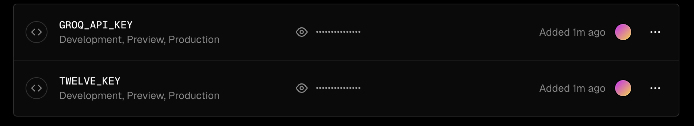

And there we go! A first deployment is ready for prod:

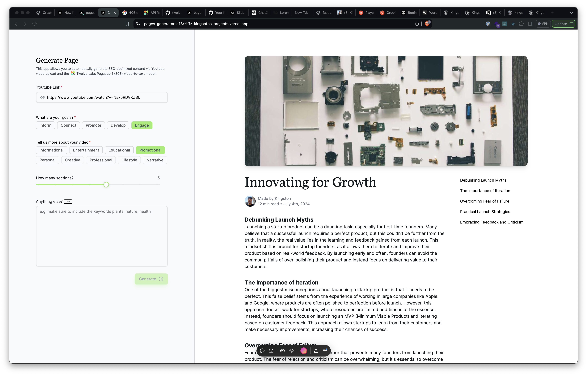

# After Thoughts

This app was not the user experience I was expecting. The bottleneck lies in the speed of the API. Look at the speeds here of the `api/twelvelabs` call vs the `api/groq` call:

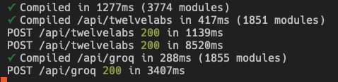

After some thought, I discovered a fundamental thought that is good to remember when deciding what you want to build with a certain service:

> The features of an API service — namely its speed, reliability, and accuracy — readily determine the feasible and best app use cases

Trying to create an application that doesn't match the technical abilities or advantages of its services, or APIs will not yield good user experiences. Here, let me a draw a rough diagram to explain. For example, I'll never use openai's dalle for chart creation. The following is what I define as a `Use Cases Diagram` ->

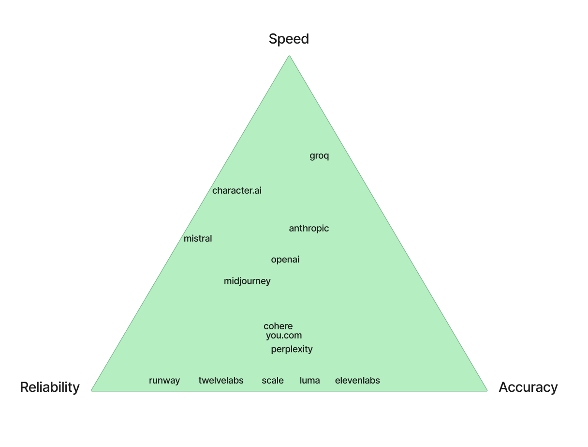

This diagram is somewhat inspired by what is known in distributed systems as the [CAP Theorem](https://en.wikipedia.org/wiki/CAP_theorem). Most companies who offer AI services (api) exist somewhere here. I've put the companies that I am familiar with or have used before.

Oftentimes, you can't have all 3, but I'm not saying the ones in the middle are better. it's just that they probably have an equal balance of all of them. You also start to notice that companies that are positioned on the bottom of the triangle are ones that are very domain specific — eg. video (Luma, runway), image (Dalle, midjourney, Krea), NeRF object (Luma Labs), or audio generation (ElevenLabs)— hence, accuracy and reliability are more important factors than speed. Therefore, I would not use those api services (at their current speed at least) for an app where speed is important. Some of the use cases that exist from the capabilities of the `reliable-accurate` services are in `asynchronous` services rather than realtime ones, eg. traffic detection, large scale video classification, data collection or labelling, hard generation tasks. And it seems like twelvelabs are already very aware of this. If they want to have more consumer level apps then they need to make their api faster. Likewise for groq, if they want more specific use cases, then they may need to move down towards accuracy (but groq's different because their core service is an inference engine wrapper).

I might continue working on this app. I find it could be a good extension of [summarize.tech](https://www.summarize.tech/).